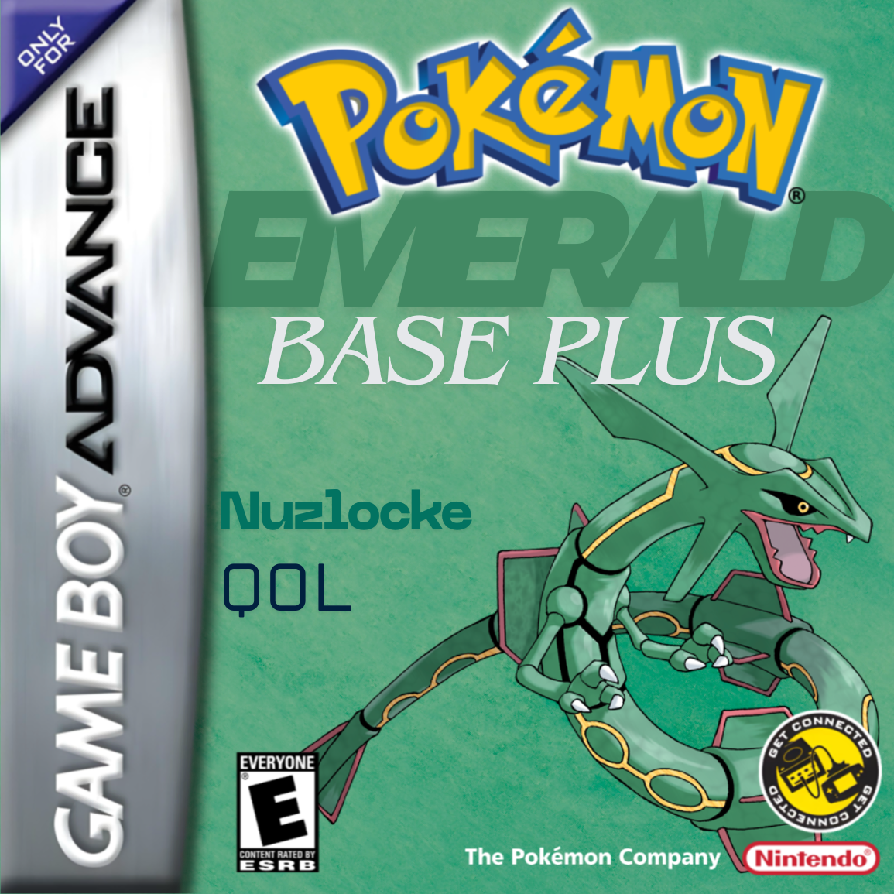
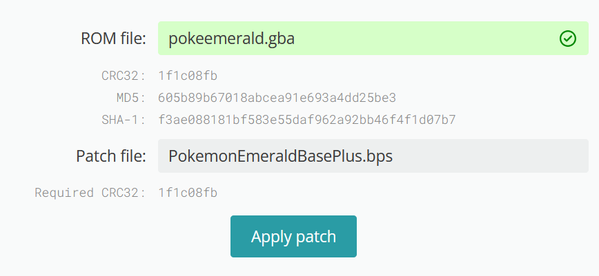
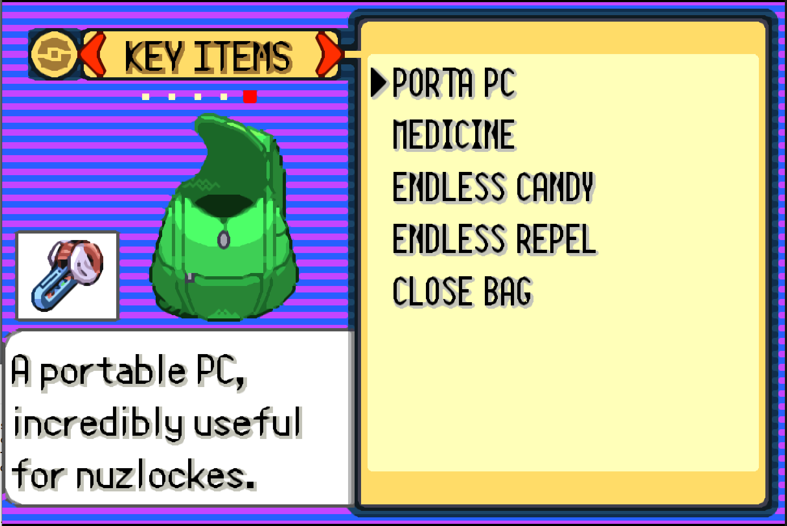
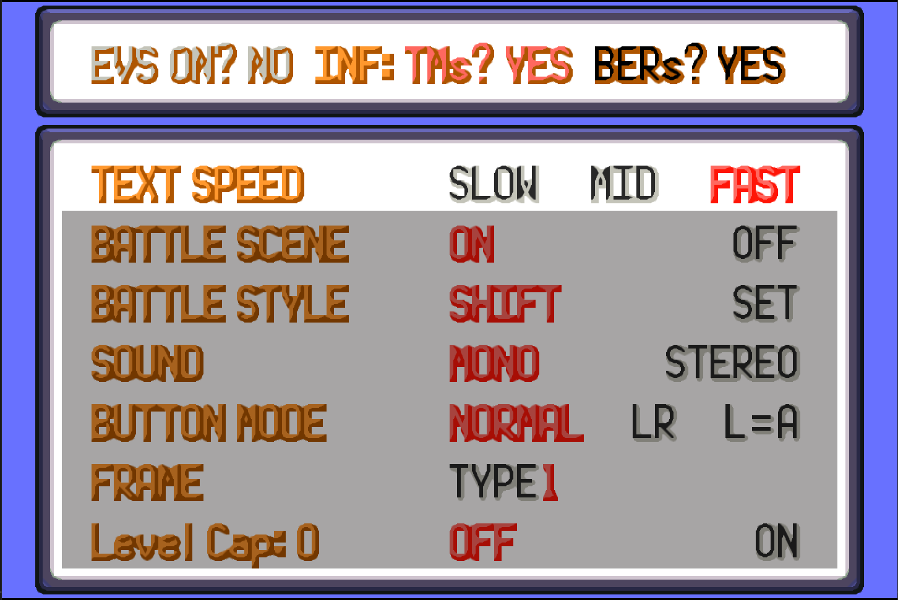
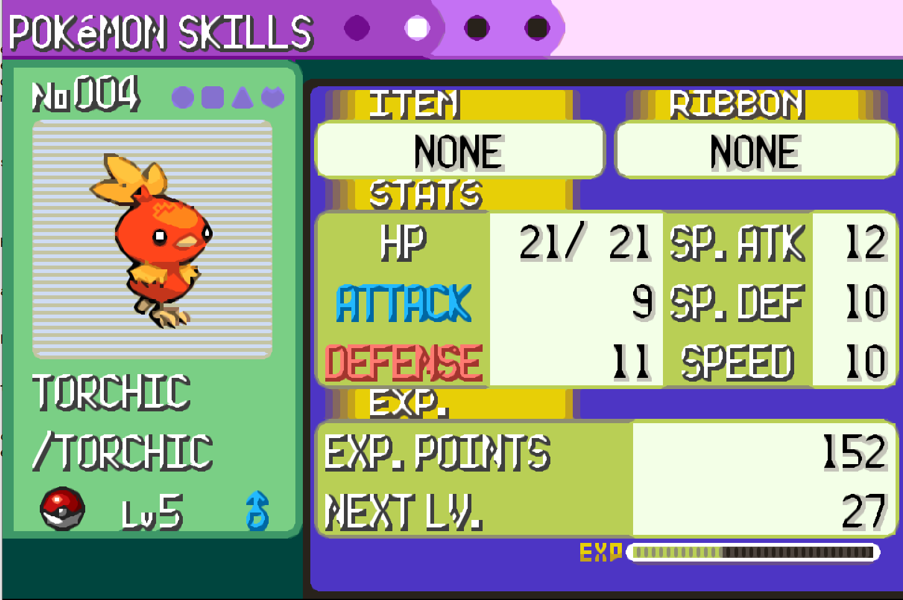

# Pokémon Emerald Base Plus v1.1

## Installation

This modification was designed with the decompilation of Pokemon Emerald in mind.

This quality of life patch requires the following version of Pokemon Emerald -> `sha1: f3ae088181bf583e55daf962a92bb46f4f1d07b7`
You can make use of the following site to apply the bps patch:
* https://www.marcrobledo.com/RomPatcher.js/

## Patch file

Download the PokemonEmeraldBasePlus.bps file and use the aforementioned patcher. Make sure your patch process looks
like the following:

# Version 1.1
The following features have been implemented:
* Faster fishing (guaranteed encounter after the first round of dots appear on the screen)
* No HM slaves needed! You can use HMs as field moves freely after earning their respective bage
* Status condition item - lets you apply any status to your selected mon

## QOL features

Note: the follwing four items are given to the player immediately after officially getting the starter from Birch.

### Portable PC
No need to run back and forth from pokemon centers to use the PC.

### Endless candy
Essentially a rare candy as a key item that obeys level caps.

### Insta healing key item
Think of it as a portable pokemon center.

### Endless repel key item
Repels wild Pokemon indefinitely until turned off.

### Level caps
Blocks Pokemon exp after reaching the cap; current cap can be viewed through the options menu.
Follows Gym leaders and Drake's highest leveled Pokemon:
* 15 - Roxanne
* 19 - Brawly
* 24 - Wattson
* 29 - Flannery
* 31 - Norman
* 33 - Winona
* 42 - Tate & Liza
* 46 - Juan
* 55 - Drake

### EVless mode
Don't want to have an advantage against enemy Pokemon? Well you can play the game without EVs (choice at the beginning of the game is permanent).

You can view which setting you are playing on through the options menu

### Enhanced summary screen
Natures are reflected in the summary screen and follows the Gen 5 and on-wards colour scheme (RED = +, BLUE = -).

You can also view your Pokemon's IVs by pressing A on the stats screen.

### Quick use items
You can spam use items on Pokemon. As long as you still have more of the item left in your bag, you will not be kicked out of the party menu screen when using them. Spam candies to your hearts desire!
